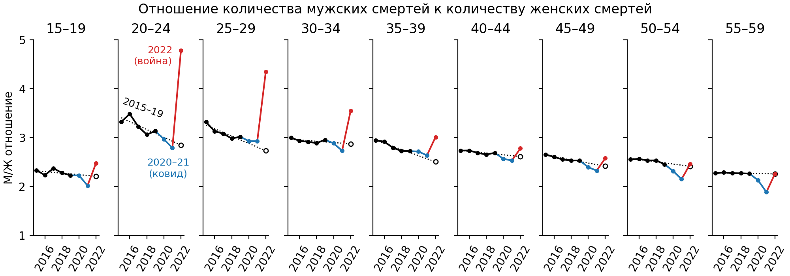

# Excess mortality in Russia due to the war in Ukraine

This repository contains data (that I obtained by request from Rosstat) on the number of deaths in Russia by federal region, year (1990 to 2022), age (5-year groups), and gender. The original XLSX files are in the `deaths-by-age-gender-region-year` folder, and my processed long-format version is available as the CSV file in GZ archive.

The code reproducing analysis published in Medusa is available in `medusa2023` Jupyter notebook.
