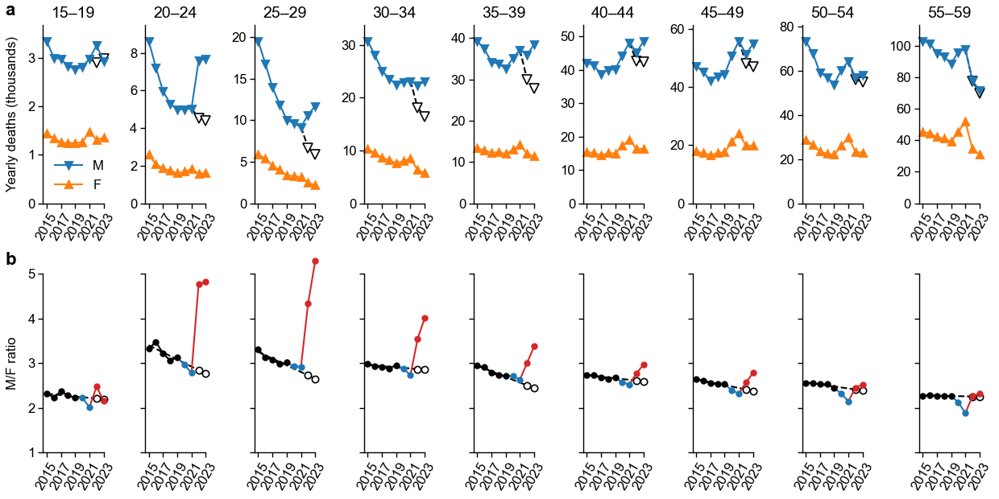

# War fatalities in Russia estimated via excess male mortality

The code reproducing analysis from https://meduza.io/feature/2023/07/10/47-tysyach-pogibshih-rossiyskih-soldat is in the `medusa2023` folder.

The code reproducing analysis from https://osf.io/preprints/socarxiv/xcrme/ is in the `arxiv2023` folder.

## Data

This repository contains the following data requested directly from Rosstat:

* Number of deaths by federal region, year (1990 to 2023), age (5-year groups), and gender.
* Number of external deaths by year (2000 to 2022) and gender.
* Number of HIV deaths by year (2006 to 2023), age (1-year groups), and gender.
