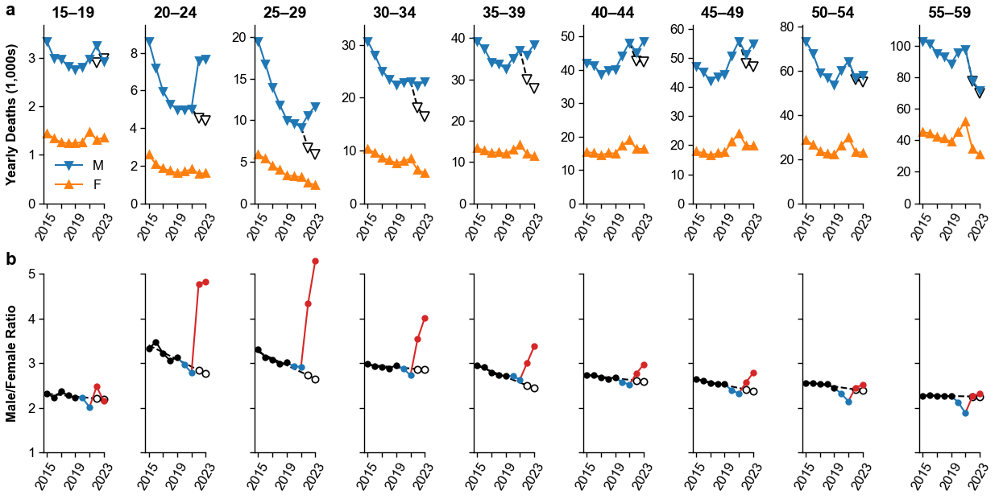

# War fatalities in Russia estimated via excess male mortality



Analysis code for the paper [Kobak et al. 2025, War Fatalities in Russia in 2022–2023 Estimated Via Excess Male Mortality: A Research Note](https://read.dukeupress.edu/demography/article/doi/10.1215/00703370-11862998/398920/War-Fatalities-in-Russia-in-2022-2023-Estimated) is in the `demography2025` folder.

How to cite:
```
@article{kobak2025war,
    title={War Fatalities in {R}ussia in 2022--2023 Estimated Via Excess Male Mortality: A Research Note},
    author = {Kobak, Dmitry and Bessudnov, Alexey and Ershov, Alexander and Mikhailova, Tatiana and Raksha, Alexey},
    journal = {Demography},
    volume = {62},
    number = {2},
    pages = {335-347},
    year = {2025},
    month = {04},
}
```

The code reproducing analysis from https://meduza.io/feature/2023/07/10/47-tysyach-pogibshih-rossiyskih-soldat is in the `medusa2023` folder.


## Data

This repository contains the following data requested directly from Rosstat:

* Number of deaths by federal region, year (1990 to 2023), age (5-year groups), and sex.
* Number of external deaths by year (2000 to 2022) and sex.
* Number of HIV deaths by year (2006 to 2023), age (1-year groups), and sex.

## Note on 2024 data

In June 2025 I requested the 2024 data but Rosstat [refused to provide it to me](https://kobak.livejournal.com/134458.html). All mortality data in Russia is now secret.
